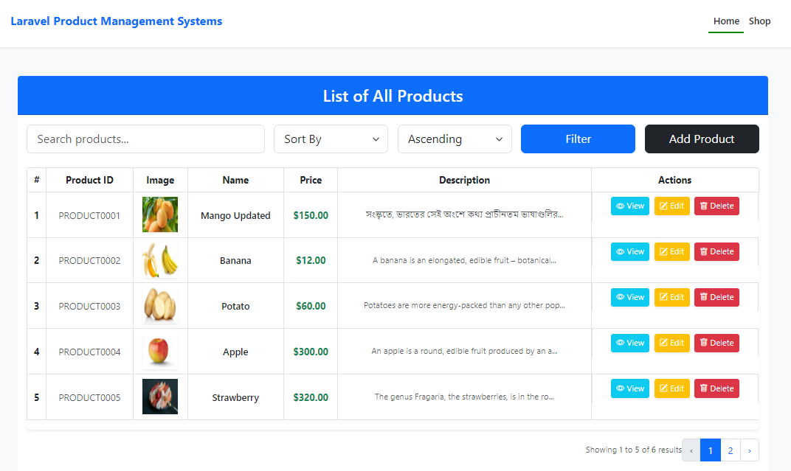
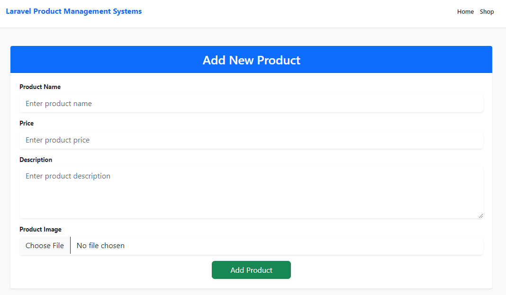
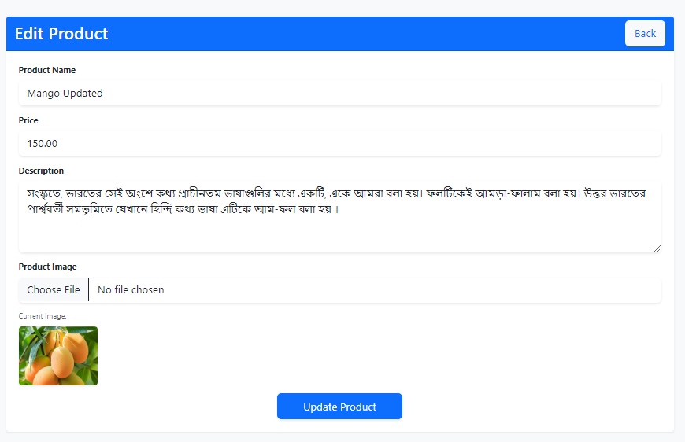
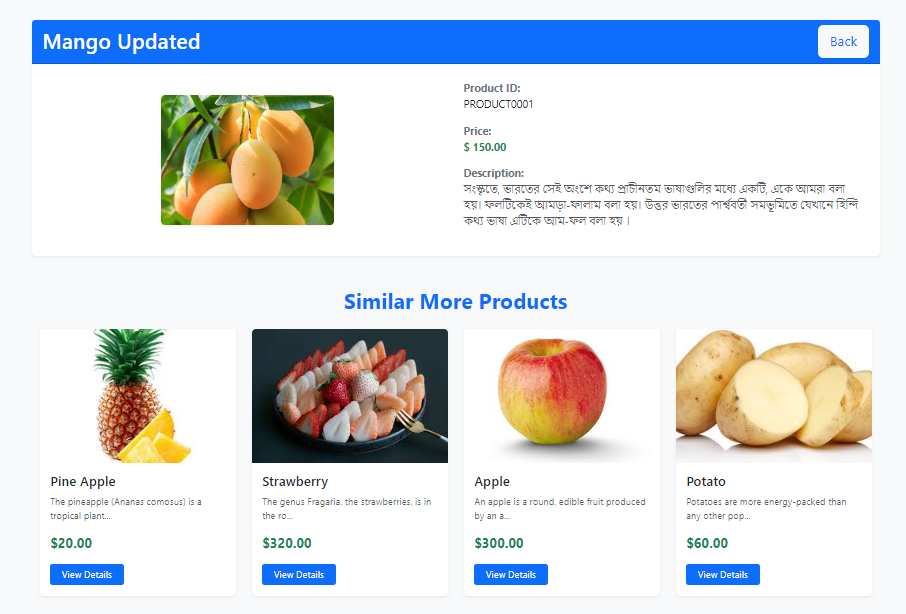
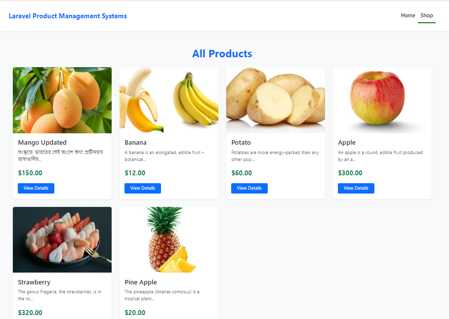

# Product Management Application

A simple web-based Product Management application built with Laravel, Bootstrap, and Bootstrap Icons. This application allows users to manage products, including viewing, editing, and deleting them.

---

## Features

- View all products in a responsive table.
- Add, edit, and delete products.
- Clean UI with Bootstrap and Bootstrap Icons for a modern design.
- Fully responsive and user-friendly.

---

## Screenshots

### Home Page


### Product Create


### Product Edit



### Product View


### Product Shop



---

## Installation

1. Clone the repository:
    ```bash
    git clone https://github.com/your-username/product-management-app.git
    cd product-management-app
    ```

2. Install dependencies:
    ```bash
    composer install
    npm install
    ```

3. Set up the environment:
    - Copy the `.env.example` file to `.env`:
        ```bash
        cp .env.example .env
        ```
    - Configure your database and other environment variables in `.env`.

4. Run migrations:
    ```bash
    php artisan migrate
    ```

5. Serve the application:
    ```bash
    php artisan serve
    ```

6. Access the application at [http://localhost:8000](http://localhost:8000).

---

## Usage

1. Navigate to the `Products` section.
2. Add, view, edit, or delete products using the intuitive interface.
3. Each product action is visually enhanced with icons for better UX.

---

## Technologies Used

- **Laravel**: PHP framework for back-end development.
- **Bootstrap 5**: For responsive UI.
- **Bootstrap Icons**: To enhance button and action visuals.

---

## Contribution

Contributions are welcome! Please follow these steps:

1. Fork this repository.
2. Create a new branch:
    ```bash
    git checkout -b feature-name
    ```
3. Commit your changes:
    ```bash
    git commit -m "Add feature description"
    ```
4. Push to your branch:
    ```bash
    git push origin feature-name
    ```
5. Create a pull request.

---

## License

This project is licensed under the [MIT License](LICENSE).

---

## Contact

For any queries or issues, feel free to reach out:

- **Author**: Saidur Rahman Bhuiyan
- **Email**: thesaidursumon@gmail.com
- **GitHub**: [https://github.com/thesaidursumon](https://github.com/thesaidursumon)

---

## Acknowledgments

- Special thanks to the Laravel and Bootstrap communities for their incredible frameworks and tools.
